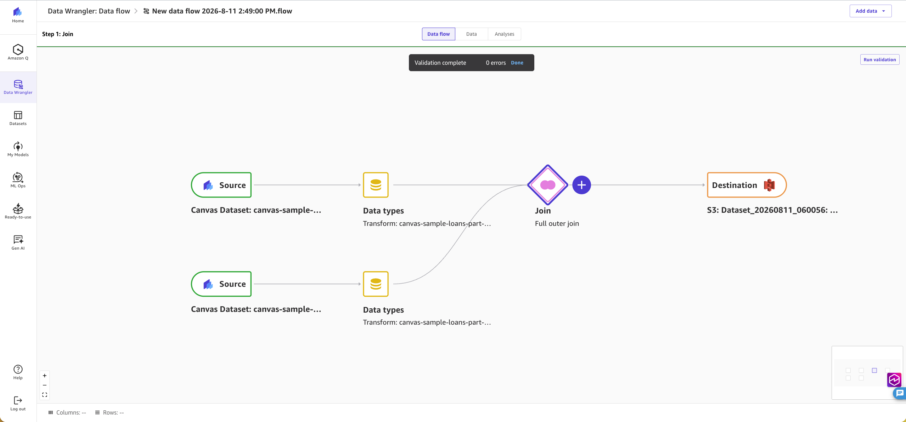
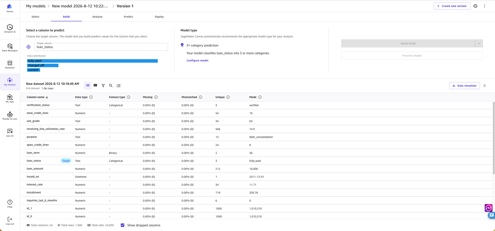
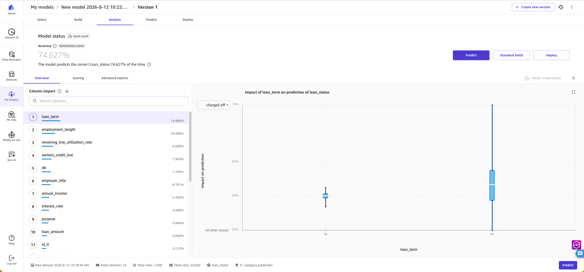
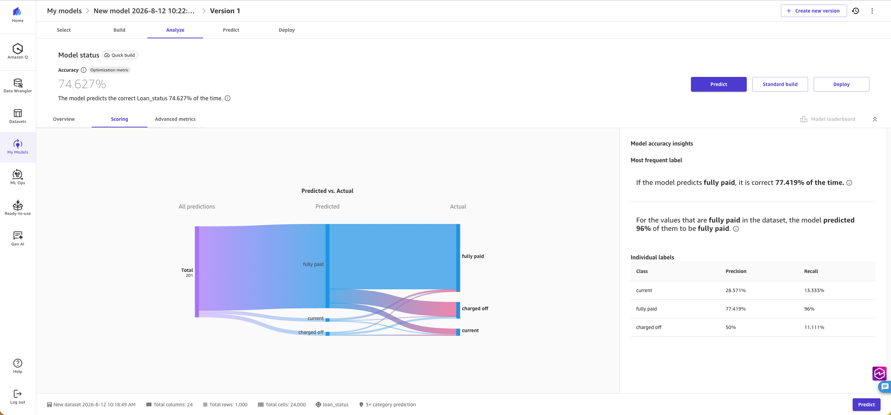
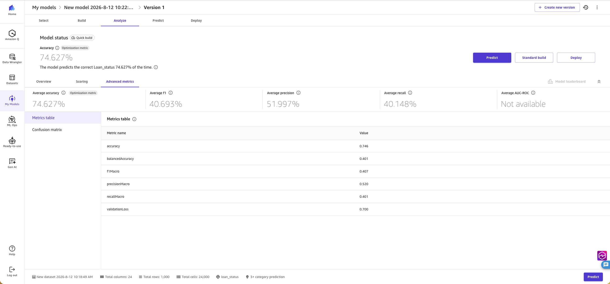
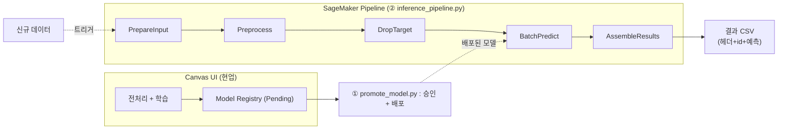
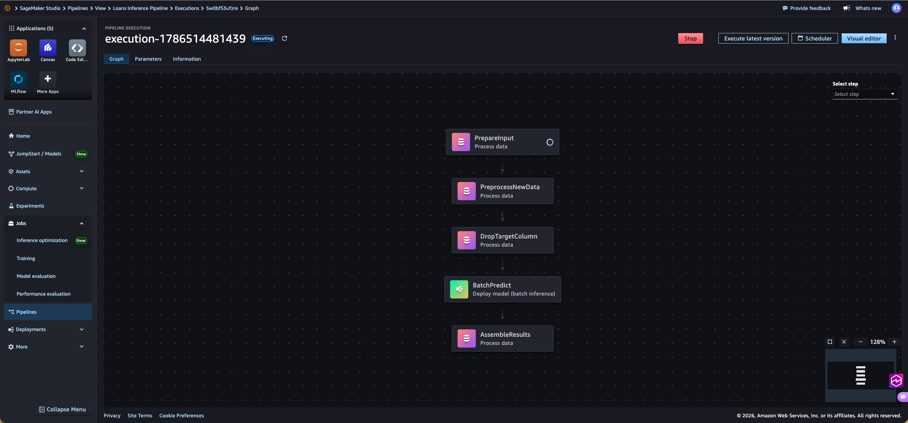

[English](README.md) | **한국어**

# Canvas 중심 MLOps — 현업이 만들고, ML팀이 자동화한다

> **좋은 모델은 알고리즘이 아니라 문제 이해에서 나온다.**
> 코드의 벽을 걷어내면 업무를 가장 잘 아는 현장 전문가가 가치 있는 모델을 먼저 만들고(Canvas),
> 그 노하우가 쌓인 뒤 ML팀이 이어받아 재현성·확장성을 갖춘 자산으로 고도화한다.

이 저장소는 **SageMaker Canvas에서 현업이 만든 모델**을, ML팀이 코드 재작성 없이
**승인 · 배포 · 배치 추론까지 자동화**하는 참조 구현(reference implementation)입니다.

---

## 1. SageMaker Canvas란?

Amazon SageMaker Canvas는 **코드 없이(No-code)** 데이터 준비부터 모델 학습·예측까지
수행하는 시각적 ML 도구입니다. 핵심은 **모델 생성 주체의 이동**입니다.

- 기존: 데이터 과학자가 Python/SDK로 모델을 만든다.
- Canvas: **도메인을 가장 잘 아는 현업(도메인 전문가)** 이 직접 만든다.

데이터와 변수의 의미를 이해하는 사람이 모델을 만들기 때문에 **유스케이스 적합도와 반복 속도**가
높아집니다. 전처리는 내부적으로 **Data Wrangler 엔진**이 담당하며, 화면에서 구성한 변환은
`.flow`라는 정의 파일로 저장됩니다.

**① 전처리 — Data Wrangler로 시각적으로 구성 (코드 없음)**

<p align="center">
  
</p>

두 데이터셋을 불러와 타입 변환 · 조인 · 저장까지 드래그로 구성합니다.

**② 모델 학습 — 예측할 컬럼만 선택**

<p align="center">
  
</p>

타깃 컬럼(`loan_status`)만 지정하면 Canvas가 모델 유형을 자동 추천하고 학습합니다.

<details>
<summary><b>▶ Canvas 모델 평가 화면 더 보기 (No-code 분석)</b></summary>

<br/>

<p align="center">
  <br/>
  <em>컬럼 영향도 (피처 중요도)</em>
</p>
<p align="center">
  <br/>
  <em>Predicted vs Actual · 클래스별 정밀도/재현율</em>
</p>
<p align="center">
  <br/>
  <em>정확도 · F1 · 정밀도 · 재현율 등 고급 지표</em>
</p>

</details>

> 💡 그러나 Canvas 단독으로는 **배포 · 거버넌스 · 모니터링 · 커스터마이징**에 한계가 있습니다.
> 그래서 "생성은 Canvas(현업), 운영은 파이프라인(ML팀)"으로 역할을 나눠 연결합니다.

---

## 2. 도입 전략 — 현업 중심 초기 개발 → ML팀 중심 고성능화

Canvas 기반 파이프라인과 코드 기반 풀스택 파이프라인을 **경쟁이 아니라 성숙도 순서**로
배치합니다. 성숙도를 단계적으로 올려 **속도(Canvas)와 완성도(코드 기반)를 모두** 얻습니다.

```
Crawl  ───────────────►  Walk  ───────────────►  Run
1단계                     2단계                    3단계
Canvas 등록→수동 배포       자동 파이프라인 구축         CI/CD 코드 기반 풀스택
(현업 주도)                (배포·배치추론 자동화)       (ML팀 주도)
                         ▲ 이 저장소가 다루는 범위
```

| 단계 | 내용 | 주체 | 성숙도 |
|---|---|---|---|
| **Crawl** | 현업이 Canvas로 모델 생성·등록 → 사람이 수동 배포. 수익성 모델을 빠르게 다수 확보 | 현업 | Level 0→1 |
| **Walk** | Canvas 등록 모델을 **자동 파이프라인으로 구축** — 승인 → 배포 → 배치 추론을 코드로 자동화해 수동 병목 제거 (모니터링·재학습은 이후 확장) | 현업 + ML팀 | Level 1 |
| **Run** | 검증된 유스케이스를 ML팀이 **코드 기반 풀스택**으로 재구현(SageMaker Pipelines + CI/CD) | ML팀 | Level 2 |

**왜 이 순서인가?**
- **리스크 최소화**: 가치가 검증된 모델만 다음 단계로 승격 → ML팀 리소스를 확실한 곳에 투입
- **빠른 성과**: Canvas로 초기 성공을 조기에 만들어 조직의 지지·예산 확보
- **노하우 전수**: 현장의 문제 정의·피처 지식이 ML팀으로 이전되어 고도화 품질 상승

> 핵심: **Canvas는 종착지가 아니라 "가장 빠른 진입점"** 입니다.
> 현장이 무엇이 돈이 되는지 먼저 증명하고, ML팀이 그것을 지속가능한 자산으로 만듭니다.

---

## 3. 이 저장소가 자동화하는 것 (Walk 단계)

현업이 Canvas에서 **전처리(flow) + 모델 학습**을 마치고 Model Registry에 등록하면,
ML팀이 아래를 **코드로 자동화**합니다. 전처리는 코드로 "번역"하지 않고 `.flow`를
**그대로 실행**하므로, 현업이 화면에서 본 전처리와 프로덕션 실행이 완전히 동일합니다.



> **실제 실행 화면** — SageMaker Studio Pipelines의 실행 그래프 (5단계):

<p align="center">
  
</p>

### 두 개의 흐름
- **① 모델 승격 (`promote_model.py`)** — Registry 패키지를 승인하고 배치 추론용 Model
  객체를 생성. 새 모델 버전마다 1회.
- **② 배치 추론 파이프라인 (`inference_pipeline.py`)** — 아래 5단계를 자동으로 이어서 실행.
  신규 데이터마다 반복(스케줄/이벤트로 자동화 가능).

### ② 배치 추론 파이프라인의 5단계
| 단계 | 스텝 | 하는 일 |
|---|---|---|
| STEP 0 | **PrepareInput** | 입력 형식 정규화 — 타깃 컬럼이 없으면 `.flow` 스키마에 맞게 **가짜 컬럼을 채움** |
| STEP 1 | **PreprocessNewData** | `.flow`를 재실행해 신규 데이터를 전처리 · 조인 (현업 전처리와 100% 동일) |
| STEP 2 | **DropTargetColumn** | 타깃 컬럼을 이름으로 **제거**하고 헤더 없는 피처 CSV로 출력 |
| STEP 3 | **BatchPredict** | 배포된 모델로 배치 추론 → 예측 결과 저장 |
| STEP 4 | **AssembleResults** | 원본(id·피처)+예측을 결합하고 **헤더를 붙여** Excel 친화적 CSV로 저장 |

> **왜 PrepareInput / DropTargetColumn 두 스텝이 필요한가**
> 학습용 `.flow`는 타깃(정답) 컬럼을 포함한 형식을 기대하는데, 실제 추론 데이터에는 타깃이
> 없습니다. 그래서 **앞에서 가짜 타깃을 채워** flow를 통과시키고, **뒤에서 다시 제거**해
> 모델이 원하는 피처 전용 형식으로 맞춥니다. 이렇게 하면 학습용 flow를 수정하지 않고
> 그대로 재사용할 수 있습니다. 두 스텝은 조건부(멱등)라 타깃이 있는 데이터가 들어와도
> 안전합니다(있으면 추가 안 함 / 있으면 제거).

### 설계 원칙
- **전처리는 번역하지 말고 그대로 실행** — `.flow`를 SageMaker Processing Job으로 실행 →
  ML팀의 코드 재작성 불필요, 현업 결과와 100% 일치
- **학습용 flow를 추론에 재사용** — flow를 고치지 않고 앞뒤에 정규화 스텝(Prepare/Drop)만 추가
- **배포 ≠ 상시 엔드포인트** — 배치 방식에서 "배포"는 Model 객체 생성(무료). 실제 과금은
  배치 추론이 실행되는 시간에만 발생 → 유휴 비용 없음
- **승인/배포와 추론 분리** — 트리거가 다르므로 별도 스크립트로 관리
- **설정 외부화** — 역할·버킷 등은 `config.py`/환경변수로 교체 가능

---

## 4. 빠른 시작

> **최초 1회 준비 필요** — Canvas에서 flow export → 프로세싱 잡 디테일 확인 →
> S3 버킷 구성 → flow 편집·재업로드. 자세한 절차는 **[docs/USAGE.ko.md](docs/USAGE.ko.md)** 참고.

```bash
export AWS_PROFILE=<your-profile>
export AWS_DEFAULT_REGION=us-east-1
python3 -m pip install -U sagemaker

# ① 승인 + 배포 (모델 버전당 1회)
python promote_model.py <model_package_arn>

# ② 배치 추론 (신규 데이터마다)
python inference_pipeline.py
```

상세 실행 방법·주의사항은 **[docs/USAGE.ko.md](docs/USAGE.ko.md)** 를 참고하세요.

---

## 5. 저장소 구조

```
canvas-pipeline/
├── README.md                 # (이 문서) 배경·전략·개요
├── docs/
│   ├── USAGE.md              # 상세 실행 가이드 · 주의사항
│   └── images/               # README 삽입용 Canvas 화면 캡처
├── config.py                 # 공통 설정 (역할·버킷·모델명, 환경변수 오버라이드)
├── promote_model.py          # [Flow 1] 모델 승인 + 배포
├── inference_pipeline.py     # [Flow 2] 전처리 + 배치 추론 파이프라인 (5단계)
├── prepare_input.py          #   └ STEP 0: 입력 정규화(타깃 없으면 가짜 컬럼 추가)
├── drop_target.py            #   └ STEP 2: 타깃 컬럼 제거(헤더 없는 피처 CSV 출력)
└── assemble_results.py       #   └ STEP 4: 원본+예측 결합, 헤더 추가(Excel 친화적)
```

---

## 6. 비용

> 실제 요금은 리전 · 인스턴스 · 사용량에 따라 다릅니다. 정확한 추정은
> [Amazon SageMaker 요금](https://aws.amazon.com/sagemaker/pricing/)과 AWS Pricing Calculator를
> 참고하세요. 여기서는 **무엇에 과금되는지(비용 구조)** 만 설명합니다.

### Canvas 사용료 (현업 · 생성 단계)
- **세션(워크스페이스) 시간당 과금** — Canvas 앱이 실행 중인 동안 시간 단위로 과금됩니다.
  ⚠️ 작업이 끝나면 **반드시 로그아웃**해야 과금이 멈춥니다(켜두면 계속 과금).
- **모델 빌드/학습** — Quick build / Standard build 시 학습 리소스 사용량만큼 과금.
- Ready-to-use 모델, Amazon Q, Bedrock 연동 등은 별도 과금될 수 있습니다.

### 파이프라인 사용료 (ML팀 · 운영 단계)
배치 방식이라 **잡이 실행되는 동안에만** 과금되고, 끝나면 인스턴스가 자동 종료됩니다(유휴 비용 0).

| 항목 | 과금 방식 |
|---|---|
| Processing 잡 (PrepareInput / Preprocess / DropTarget / AssembleResults) | 인스턴스 실행 시간(초 단위) |
| Batch Transform (BatchPredict) | 인스턴스 실행 시간(초 단위) |
| S3 저장 | raw · flow · 결과 데이터 저장 용량 |
| Model 객체 · Model Registry · Pipeline 정의 | **무료 (메타데이터)** |

### 비용 관점 핵심
- **상시 엔드포인트 없음** → 24시간 도는 추론 인프라 비용이 없습니다(배치 방식의 최대 장점).
- 신규 데이터가 올 때만 잡이 잠깐 떴다가 사라짐 → **사용한 만큼만** 과금.
- 주요 절감 포인트: **Canvas 세션 로그아웃**, 불필요한 **실시간 엔드포인트 삭제**,
  인스턴스 타입을 데이터 규모에 맞게 조정.

---

## 7. 참고

**AWS 공식 문서**
- [Amazon SageMaker Canvas](https://docs.aws.amazon.com/sagemaker/latest/dg/canvas.html) — No-code ML
- [SageMaker Pipelines](https://docs.aws.amazon.com/sagemaker/latest/dg/pipelines.html) — ML 워크플로 오케스트레이션
- [Data Wrangler](https://docs.aws.amazon.com/sagemaker/latest/dg/data-wrangler.html) — 시각적 데이터 전처리(`.flow`)
- [Model Registry](https://docs.aws.amazon.com/sagemaker/latest/dg/model-registry.html) — 모델 버전 관리·승인
- [Batch Transform](https://docs.aws.amazon.com/sagemaker/latest/dg/batch-transform.html) — 배치 추론
