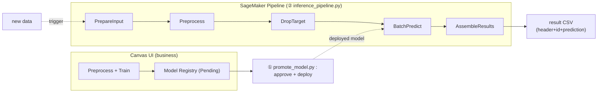

**English** | [한국어](README.ko.md)

# Canvas-Centered MLOps — Business Builds, ML Team Automates

> **A good model comes from understanding the problem, not from the algorithm.**
> Remove the coding barrier and the domain expert who knows the work best builds a
> valuable model first (Canvas); once that know-how accumulates, the ML team takes it
> over and hardens it into a reproducible, scalable asset.

This repository is a reference implementation that takes a model built by business users in
**SageMaker Canvas** and lets the ML team **approve, deploy, and run batch inference** on new
data — fully automated.

---

## 1. What is SageMaker Canvas?

Amazon SageMaker Canvas is a visual, **no-code** ML tool that covers everything from data prep
to model training and prediction. Its key idea is the **shift in who builds models**:

- Before: data scientists build models with Python/SDK.
- Canvas: the **domain expert who knows the data best** builds them directly.

Because the person who understands the data and its variables builds the model, **use-case fit
and iteration speed** improve. Preprocessing is handled internally by the **Data Wrangler
engine**, and the transforms configured on screen are saved as a `.flow` definition file.

**① Preprocessing — built visually in Data Wrangler (no code)**

<p align="center">
  
</p>

Load two datasets and configure type casting · join · export by drag-and-drop.

**② Model training — just pick the column to predict**

<p align="center">
  
</p>

Specify only the target column (`loan_status`) and Canvas recommends the model type and trains it.

<details>
<summary><b>▶ More: Canvas model evaluation screens (no-code analysis)</b></summary>

<br/>

<p align="center">
  <br/>
  <em>Column impact (feature importance)</em>
</p>
<p align="center">
  <br/>
  <em>Predicted vs Actual · per-class precision/recall</em>
</p>
<p align="center">
  <br/>
  <em>Accuracy · F1 · precision · recall and other advanced metrics</em>
</p>

</details>

> 💡 On its own, however, Canvas has limits in **deployment · governance · monitoring ·
> customization**. So we split roles: "creation in Canvas (business), operation in the
> pipeline (ML team)."

---

## 2. Adoption Strategy — Business-First Development → ML-Team Hardening

Rather than treating the Canvas-based pipeline and the code-based full-stack pipeline as
competitors, we place them along a **maturity path**. By raising maturity step by step, we get
**both speed (Canvas) and completeness (code-based)**.

```
Crawl  ─────────────►  Walk  ─────────────►  Run
Stage 1                Stage 2                Stage 3
Canvas → manual deploy  Automated pipeline    CI/CD code-based full stack
(business-led)          (deploy+batch infer)  (ML-team-led)
                        ▲ scope of this repo
```

| Stage | Description | Owner | Maturity |
|---|---|---|---|
| **Crawl** | Business builds & registers models in Canvas → human manually deploys. Quickly secure many profitable models | Business | Level 0→1 |
| **Walk** | **Build automated pipelines** for the registered model — automate approve → deploy → batch inference to remove manual bottlenecks (monitoring/retraining added later) | Business + ML team | Level 1 |
| **Run** | ML team re-implements the validated use case as a **code-based full stack** (SageMaker Pipelines + CI/CD) | ML team | Level 2 |

**Why this order?**
- **Minimize risk**: only models with proven value advance → ML-team resources go where it counts.
- **Fast wins**: early Canvas success secures organizational buy-in and budget.
- **Know-how transfer**: field knowledge (problem definition, features) flows to the ML team, raising the quality of later hardening.

> Key: **Canvas is not the destination — it's the fastest entry point.**
> The field proves what's valuable first, and the ML team makes it sustainable.

---

## 3. What This Repository Automates (the Walk stage)

Once business users finish **preprocessing (flow) + model training** in Canvas and register to
the Model Registry, the ML team **automates the following in code**. Preprocessing is not
"translated" into code — the `.flow` is **executed as-is**, so what business users saw on screen
matches production exactly.



> **Actual run** — the execution graph in SageMaker Studio Pipelines (5 steps):

<p align="center">
  
</p>

### Two flows
- **① Model promotion (`promote_model.py`)** — approve the Registry package and create a
  Model object for batch inference. Once per new model version.
- **② Batch inference pipeline (`inference_pipeline.py`)** — runs the 5 steps below in sequence.
  Repeated per new data (can be automated via schedule/event).

### The 5 steps of the batch inference pipeline
| Step | Name | What it does |
|---|---|---|
| STEP 0 | **PrepareInput** | Normalize input format — if the target column is missing, **fill a dummy column** to match the `.flow` schema |
| STEP 1 | **PreprocessNewData** | Re-run the `.flow` to preprocess · join new data (100% identical to the business preprocessing) |
| STEP 2 | **DropTargetColumn** | **Remove** the target column by name and output a header-less feature CSV |
| STEP 3 | **BatchPredict** | Batch inference with the deployed model → save predictions |
| STEP 4 | **AssembleResults** | Join original (id·features) + predictions and **add a header** → Excel-friendly CSV |

> **Why PrepareInput / DropTargetColumn both exist**
> The training `.flow` expects a format that includes the target (answer) column, but real
> inference data has no target. So we **fill a dummy target up front** to pass the flow, and
> **remove it afterward** to match the feature-only format the model wants. This lets us reuse
> the training flow without modifying it. Both steps are conditional (idempotent), so they're
> safe even if target-bearing data comes in (won't add if present / removes if present).

### Design principles
- **Don't translate preprocessing — execute it as-is** — run the `.flow` as a SageMaker
  Processing Job → no code rewrite for the ML team, 100% match with business results.
- **Reuse the training flow for inference** — add normalization steps (Prepare/Drop) around it instead of editing the flow.
- **Deploy ≠ always-on endpoint** — in the batch approach, "deploy" means creating a Model
  object (free). Cost accrues only while batch inference runs → no idle cost.
- **Separate promotion/deploy from inference** — different triggers, so separate scripts.
- **Externalize config** — role, bucket, etc. are swappable via `config.py`/environment variables.

---

## 4. Quick Start

> **One-time setup required** — export the flow from Canvas → check processing job details →
> set up the S3 bucket → edit & re-upload the flow. See **[docs/USAGE.md](docs/USAGE.md)** for details.

```bash
export AWS_PROFILE=<your-profile>
export AWS_DEFAULT_REGION=us-east-1
python3 -m pip install -U sagemaker

# ① approve + deploy (once per model version)
python promote_model.py <model_package_arn>

# ② batch inference (per new data)
python inference_pipeline.py
```

For detailed steps and caveats, see **[docs/USAGE.md](docs/USAGE.md)**.

---

## 5. Repository Structure

```
canvas-pipeline/
├── README.md                 # (this file) background · strategy · overview
├── docs/
│   ├── USAGE.md              # detailed run guide · caveats
│   └── images/               # Canvas screenshots used in the README
├── config.py                 # shared config (role·bucket·model name, env overrides)
├── promote_model.py          # [Flow 1] model approve + deploy
├── inference_pipeline.py     # [Flow 2] preprocess + batch inference pipeline (5 steps)
├── prepare_input.py          #   └ STEP 0: normalize input (add dummy col if target missing)
├── drop_target.py            #   └ STEP 2: drop target column (header-less feature CSV)
└── assemble_results.py       #   └ STEP 4: join original+prediction, add header (Excel-friendly)
```

---

## 6. Cost

> Actual pricing varies by region · instance · usage. For accurate estimates, see
> [Amazon SageMaker pricing](https://aws.amazon.com/sagemaker/pricing/) and the AWS Pricing
> Calculator. Here we only describe **what incurs cost (the cost model)**.

### Canvas usage (business · creation stage)
- **Per-hour session (workspace) charge** — billed hourly while the Canvas app is running.
  ⚠️ **Log out when done** to stop charges (leaving it on keeps billing).
- **Model build/training** — Quick/Standard build is charged by training resource usage.
- Ready-to-use models, Amazon Q, Bedrock integration, etc. may be billed separately.

### Pipeline usage (ML team · operation stage)
Because it's batch, you're billed **only while jobs run**, and instances auto-terminate when done (zero idle cost).

| Item | Billing |
|---|---|
| Processing jobs (PrepareInput / Preprocess / DropTarget / AssembleResults) | Instance run time (per second) |
| Batch Transform (BatchPredict) | Instance run time (per second) |
| S3 storage | Stored volume of raw · flow · result data |
| Model object · Model Registry · Pipeline definition | **Free (metadata)** |

### Cost takeaways
- **No always-on endpoint** → no 24/7 inference infra cost (the biggest advantage of batch).
- Jobs spin up briefly only when new data arrives → **pay only for what you use**.
- Main savings: **log out of Canvas**, delete unused **real-time endpoints**, right-size instances.

---

## 7. References

**AWS official docs**
- [Amazon SageMaker Canvas](https://docs.aws.amazon.com/sagemaker/latest/dg/canvas.html) — no-code ML
- [SageMaker Pipelines](https://docs.aws.amazon.com/sagemaker/latest/dg/pipelines.html) — ML workflow orchestration
- [Data Wrangler](https://docs.aws.amazon.com/sagemaker/latest/dg/data-wrangler.html) — visual data preprocessing (`.flow`)
- [Model Registry](https://docs.aws.amazon.com/sagemaker/latest/dg/model-registry.html) — model versioning & approval
- [Batch Transform](https://docs.aws.amazon.com/sagemaker/latest/dg/batch-transform.html) — batch inference
